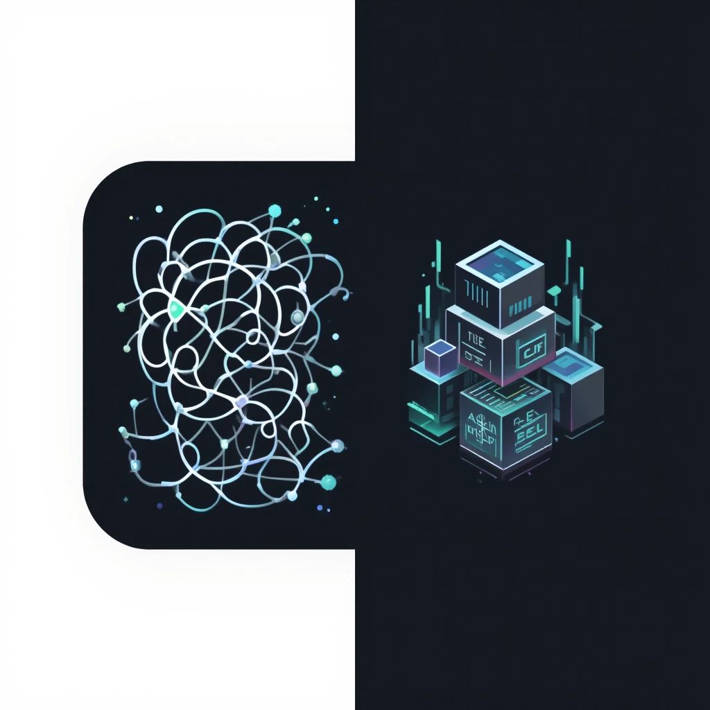

# GPT Conversation Exporter & Formatter 📜✨🧹

<div align="center">
  
  <p><strong>من الفوضى الخام... إلى الكنز المنظم!</strong></p>
</div>

هل سبق لك أن قمت بتصدير سجل محادثاتك من ChatGPT لتجد نفسك أمام ملفات معقدة وغير قابلة للاستخدام؟ 🤯

هذا المشروع هو الحل النهائي! إنه يوفر الأدوات اللازمة لتحويل بيانات محادثاتك، سواء كانت من ملف HTML أو من ملف `conversations.json` الرسمي، إلى صيغة JSON نظيفة، واضحة، وجاهزة للاستخدام في أي مشروع.

---

## 🎯 المشكلة التي يحلها المشروع

عند تصدير بياناتك من ChatGPT، تواجه أحد سيناريوهين:

1.  **ملف HTML واحد:** يحتوي على كل المحادثات، لكن استخراجها بشكل منظم يتطلب برمجة.
2.  **ملف `conversations.json`:** يبدو أنه الحل الأمثل، لكن هيكله الداخلي مصمم للتطبيق نفسه، وليس لك:
    *   **هيكل مترابط:** الرسائل ليست في قائمة، بل مرتبطة ببعضها عبر `parent` و `children` IDs، مثل سلسلة معقدة 🔗.
    *   **مليء بالضوضاء:** يحتوي على كم هائل من البيانات الوصفية (metadata) والتفاصيل التقنية التي لا تحتاجها.
    *   **صعب الاستخدام:** قراءته أو تحليله يتطلب كتابة كود مخصص ومعقد لـ "إعادة بناء" كل محادثة.

باختصار، البيانات الخام هي كنز مدفون تحت طبقات من التعقيد. **مهمة هذا المشروع هي استخراج هذا الكنز لك.**

---

## ✨ الحل: أداتان في مستودع واحد

يقدم هذا المستودع حلاً متكاملاً عبر أداتين:

| الأداة | اللغة | الوصف |
| :--- | :--- | :--- |
| **`html_extractor.js`** | `JavaScript` | سكريبت تضعه في Console المتصفح لاستخراج المحادثات من ملف HTML وحفظها كملف JSON منظم. |
| **`converter.py`** | `Python` | سكريبت بايثون قوي يقوم بتحويل ملف `conversations.json` المعقد إلى ملف JSON نظيف ومرتب. |

---

## 📊 مثال: قبل وبعد (باستخدام `converter.py`)

لتوضيح قوة التحويل، انظر إلى الفرق:

**📉 قبل: جزء من `conversations.json` الخام**
```json
{
    "title": "Lost Angel Concept Exploration",
    "mapping": {
        "bbb21f71...": {
            "id": "bbb21f71...",
            "message": {
                "author": { "role": "user" },
                "content": { "parts": ["Lost angel"] }
            },
            "parent": "ef4e9624...",
            "children": ["b54f5813..."]
        },
        "b54f5813...": {
            "id": "b54f5813...",
            "message": {
                "author": { "role": "assistant" },
                "content": { "parts": ["\"Lost Angel\"… عبارة تحمل..."] }
            },
            "parent": "bbb21f71...",
            "children": []
        }
    }
}
```

**📈 بعد: النتيجة في `conversations_formatted.json`**
```json
[
  {
    "title": "Lost Angel Concept Exploration",
    "messages": [
      {
        "author": "user",
        "content": "Lost angel"
      },
      {
        "author": "assistant",
        "content": "\"Lost Angel\"… عبارة تحمل في طياتها ألف حكاية..."
      }
    ]
  }
]
```
النتيجة النهائية هي بيانات نظيفة، هرمية، وجاهزة للأرشفة، التحليل، أو إدخالها في تطبيقات أخرى.

---

## 🚀 طريقة الاستخدام

اختر الأداة التي تناسب ملفك:

### 1️⃣ الأداة الأولى: استخراج من ملف HTML (`html_extractor.js`)

إذا كان لديك ملف `chat.html`، اتبع الخطوات التالية:

1.  **افتح الملف:** افتح ملف `chat.html` في متصفح جوجل كروم أو أي متصفح مشابه.
2.  **افتح أدوات المطور:** اضغط `F12` (أو `Ctrl+Shift+I`) لفتح Developer Tools.
3.  **اذهب إلى Console:** انتقل إلى تبويب "Console".
4.  **انسخ والصق:** انسخ محتوى ملف `html_extractor.js` بالكامل والصقه في الـ Console.
5.  **اضغط Enter:** سيقوم السكريبت بالعمل تلقائيًا وسيبدأ تحميل ملف `conversations.json` النظيف.

### 2️⃣ الأداة الثانية: تحويل `conversations.json` (`converter.py`)

إذا كان لديك ملف `conversations.json` الرسمي من ChatGPT، اتبع الخطوات التالية:

1.  **المتطلبات:** تأكد من وجود [بايثون 3](https://www.python.org/downloads/) مثبتًا على جهازك.
2.  **حمّل المستودع:** قم بتحميل أو عمل `clone` لهذا المستودع:
    ```bash
    git clone https://github.com/seif4d/GPT-JSON-Formatter.git
    cd GPT-JSON-Formatter
    ```
3.  **ضع ملفك:** ضع ملف `conversations.json` الخام الذي قمت بتصديره **في نفس المجلد**.
4.  **شغّل السكريبت:** افتح الطرفية (Terminal) في هذا المجلد ونفذ الأمر:
    ```bash
    python converter.py
    ```
5.  **تم! 🎉** سيظهر ملف جديد اسمه `conversations_formatted.json`. هذا هو كنزك المنظم!

---

## 🤝 للمساهمة

هذا المشروع وُلد من حاجة حقيقية ونقاش مثمر. إذا كانت لديك أفكار لتحسينه، أو وجدت حالات لم يعالجها السكريبت، فلا تتردد في فتح "Issue" أو تقديم "Pull Request". مساهمتك ستكون محل تقدير كبير!

## ⚖️ الترخيص

مرخص تحت [رخصة MIT](LICENSE).
